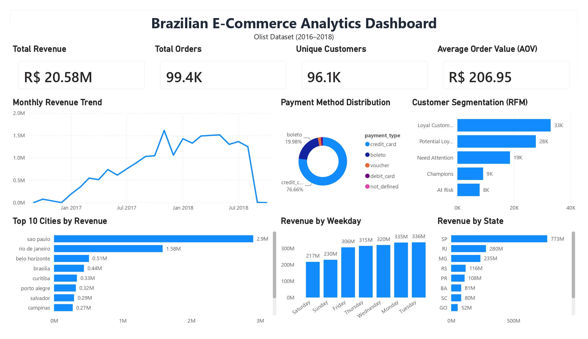

# Brazilian E-Commerce Business Analysis
A comprehensive data analytics project exploring customer behavior, sales performance, and business insights using the Brazilian E-Commerce Public Dataset by Olist.

---

## Dashboard Preview

<p align="center">
  
</p>

---

## Project Overview
This project analyzes the Brazilian E-Commerce Public Dataset provided by Olist. The objective is to uncover valuable business insights through exploratory data analysis and interactive dashboards.

The project includes:
- Data Cleaning
- Exploratory Data Analysis (EDA)
- Feature Engineering
- Business KPI Analysis
- Power BI Dashboard Development

---

## Objectives
- Analyze sales performance over time
- Identify top-performing cities and states
- Evaluate customer purchasing behavior
- Analyze payment method distribution
- Perform RFM customer segmentation
- Build an interactive business dashboard

---

## Dataset
**Source**
Brazilian E-Commerce Public Dataset by Olist
https://www.kaggle.com/datasets/olistbr/brazilian-ecommerce

The dataset contains:
- 100k+ orders
- Customer information
- Products
- Sellers
- Payments
- Reviews
- Geolocation

---

## Tools & Technologies
- Python
- Pandas
- NumPy
- Matplotlib
- Seaborn
- Jupyter Notebook
- Power BI
- Git
- GitHub

---

## Project Workflow
Raw Dataset
↓
Data Cleaning
↓
Exploratory Data Analysis
↓
Business KPI Generation
↓
CSV Dashboard Dataset
↓
Power BI Dashboard

---

## Key Performance Indicators (KPIs)
- Total Revenue
- Total Orders
- Unique Customers
- Average Order Value (AOV)

---

## Dashboard Features
- Monthly Revenue Trend
- Top 10 Cities by Revenue
- Revenue by State
- Revenue by Weekday
- Payment Method Distribution
- Customer Segmentation (RFM)

---

## Repository Structure
```text
dashboard/
data/
images/
notebooks/
report/
README.md
requirements.txt
```

---

## Key Insights
- Revenue experienced significant growth throughout 2017.
- Credit Card is the dominant payment method.
- São Paulo contributes the highest revenue.
- Loyal Customers represent the largest customer segment.
- Revenue is concentrated in southeastern Brazil.

---

## Future Improvements
- Interactive filters and slicers
- Forecasting dashboard
- Customer Lifetime Value (CLV) prediction
- Product recommendation system

---

## Author
**Cepin Marsal Javier Hilmi Darmawan**
Institut Teknologi Nasional Bandung

GitHub:
https://github.com/CepinMarsal
LinkedIn:
linkedin.com/in/cepinmarsal
